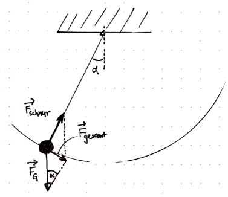

## Das Fadenpendel

### Eigenschaften eines Fadenpendels

Sieh Dir das Video "Das Fadenpendel" auf youtube an:

<a href="https://www.youtube.com/watch?v=Hb5HpFEAOMQ"> https://www.youtube.com/watch?v=Hb5HpFEAOMQ </a>

Die wichtigsten Kenngrößen eines Fadenpendels sind seine Länge l und die Schwingungsdauer T für eine vollständige Schwingung. Die Länge wird vom Aufhängepunkt bis zum Schwerpunkt der Pendelmasse gemessen. 

<ol start="1">
	<li>Die Schwingungsdauer T kann mit hoher Genauigkeit gemessen werden, indem man die Zeit für mehrere Schwingungen durch die Anzahl der Schwingungen dividiert. Bestimme auf diesem Weg die Schwingungsdauer des Fadenpendels im Video.</li>
</ol>

### Experimente mit dem Fadenpendel

In diesem Abschnitt sollst Du Experimente mit einem selbst angefertigten Fadenpendel durchführen. Einen Faden findest Du hoffentlich bei Dir zu Hause. Die Pendelmasse kann eine Schraubenmutter, eine Rolle Tesafilm, eine Getränkeflasche, aber auch ein Fahrradreifen sein. Achte darauf, dass der Faden der Belastung durch die Pendelmasse auch standhält. Das freie Ende des Fadens kannst Du an einem Stab (Stift) befestigen und diesen dann auf den Rand einer Tischplatte legen. Zur Befestigung kannst Du eine schweres Buch o.ä. drauflegen.

<ol start="2">
	<li>Lenke Dein Pendel bei fester Fadenlänge mehrfach unterschiedlich weit aus und miss mit Hilfe einer Stoppuhr und der in 2. erläuterten Messtechnik jeweils die Schwingungsdauer. Formuliere eine Aussage über den Einfluss der anfänglichen Auslenkung auf die Schwingungsdauer.</li>
	<li>Miss für 5 verschiedene Fadenlägen die Schwingungsdauer Deines Fadenpendels. Trage die Messwerte in eine Tabelle ein und zeichne dazu ein l-T-Diagramm (Fadenlänge nach rechts; Schwingungsdauer nach oben).</li>
	<li>Für die Schwingungsdauer eine Fadenpendels gilt die Formel $T= 2⋅π⋅\sqrt{\frac{l}{g}}$, wobei g der Ortsfaktor $9,81 \frac{m}{s^2}$ ist. Welche Form muss Dein Diagramm also haben?
	Überprüfe für die Werte aus 3., ob die Formel in Deinem Fall erfüllt ist. </li>
	<li>Im Bild siehst Du die Skizze eines Fadenpendels mit den darauf wirkenden Kräften. Gib die auf die Pendelmasse wirkende Gesamtkraft in Abhängikeit von FG und α an. Zeige mit Hilfe des 2. Newtonschen Gesetzes, dass die Pendelmasse keinen Einfluss auf die Schwingungsdauer hat.
	</li>
</ol>

<figure>
	
	<figcaption>Skizze eines Fadenpendels mit den wirkenden Kräften und dem Auslenkungswinkel α.</figcaption>
</figure>

